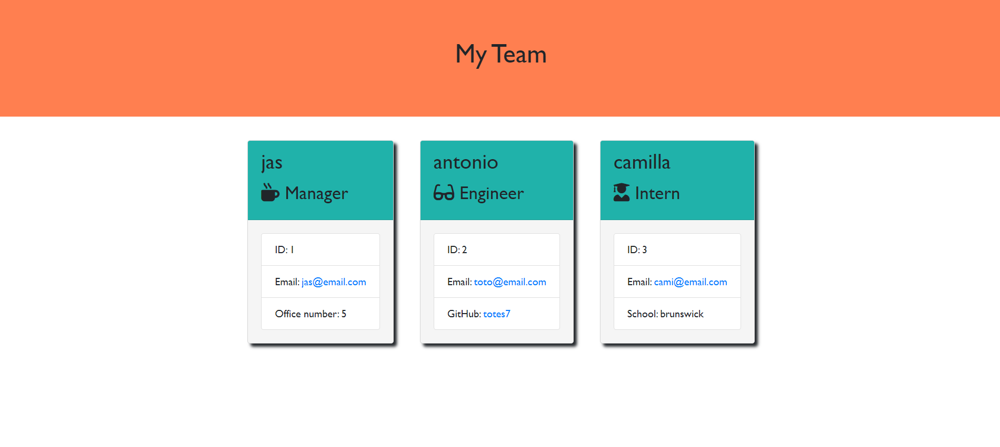

# Team Profile Generator
  
  
  ## Description

   This application will take in information about employees on a software engineering team, then generates an HTML webpage that displays summaries for each person.

   Here is a mock up of a generated html page.

   

  ## Table of Contents

  * [Installation](#installation)
  * [Usage](#usage)
  * [Contributing](#contributing)
  * [Tests](#tests)
  * [Questions](#questions)
  * [License](#license)
  
  ## Installation

  * Open the GitHub repository.
    *  Clone the repository on your device.
    *  Open the repository in an IDE.
    *  Run npm i to install the required libraries.
    *  Run node index.js to start the application.
    

  ## Usage

  Once you run node index.js in your terminal, you'll be presented with a series of question regarding the different sections of the readme file. Just answer the questions and at the end you'll find that the application generated a complete readme file with all your specifications.

  ## Contributing

  If you ant to contribute to the project just share it with friends.

  ## Tests

  Jest has been used to test all different js classes. The application passes all tests.

  ## Questions

  * If you have any additional questions, you can:
    * Visit my [GitHub](#https://github.com/totes7) page.
    * Email me at topomango7@gmail.com.
  
  ## License

  Licensed under the MIT License;
